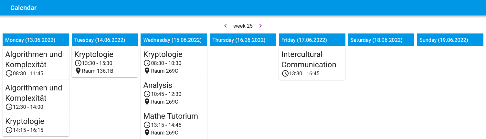

# React Calendar

A simple react application to browse an iCal file.

## Usage

Download the latest release from the releases page. Edit the `config.js` file to point to your iCal file. This works even cross domain, if the CORS Headers are set correctly.

Host the files with nginx or any other webserver, no dynamic webserver is required. It is limited to the root of a domain, not a subdirectory.

## Licenses

- [ical.js](https://www.npmjs.com/package/ical.js) licensed under [MPL-2.0](https://www.mozilla.org/en-US/MPL/2.0/)
- [ical.d.ts](https://github.com/etesync/ios/blob/master/src/types/ical.js.d.ts) licensed under [MPL-2.0](https://www.mozilla.org/en-US/MPL/2.0/)
- [Roboto](https://fonts.google.com/specimen/Roboto) licensed under [Apache-2.0](https://www.apache.org/licenses/LICENSE-2.0)
